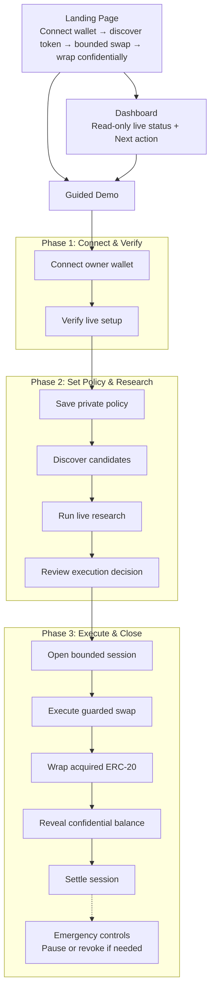

# NoxPilot

NoxPilot is a hybrid hackathon MVP for confidential, bounded crypto execution.

- TypeScript / Next.js owns wallet UX, Nox Handle encryption, contract interaction, execution orchestration, and the operator dashboard.
- Python / FastAPI owns research ranking, explanation, and live market-data ingestion.
- Solidity defines the bounded session-control layer through `PolicyVault` and `ExecutionGuard`.

The judged/demo path is now live by default:

- real wallet connection
- Arbitrum Sepolia contract reads and writes
- wallet-backed Nox Handle encryption
- live FastAPI research responses
- live fetched market inputs
- real on-chain session open / guarded swap execution / confidential wrap / owner reveal / settlement sweep

The operator UX now follows one guided path:

- landing page frames the 3-minute journey: connect wallet, discover token, bounded swap, wrap confidentially
- dashboard is intentionally read-only and always points the operator back to the guided demo for actions
- demo flow is grouped into `Connect & Verify`, `Set Policy & Research`, and `Execute & Close`
- a shared `Next action` banner keeps the current live task obvious on both `/dashboard` and `/demo`
- readiness now checks the FastAPI agent, ChainGPT configuration, wrapper config, and USDC session funding state

## Guided UX Flow



## Why Hybrid

The split is deliberate:

- TypeScript keeps wallet control, contract writes, and privacy-sensitive policy handling on the web3-native side.
- Python stays focused on ranking, explanation, and live market-data processing without ever touching wallet authority.

That boundary is the trust model.

## Repo Structure

```text
/apps
  /web        Next.js 15 operator console and judged demo surface
  /agent      FastAPI research agent with live market-data fetches
/contracts    Foundry contracts for session control and execution guardrails
/packages
  /shared     Shared schemas, constants, and dev-only mock data
  /nox-sdk    Wrapper around @iexec-nox/handle
  /ui         Reusable UI primitives
/docs         PRD, architecture, and demo script
```

## Local Setup

### 1. Install JS dependencies

```bash
pnpm install
pnpm build:nox-sdk
```

### 2. Configure env

```bash
cp .env.example .env
cp apps/web/.env.example apps/web/.env.local
cp apps/agent/.env.example apps/agent/.env
cp contracts/.env.example contracts/.env
```

If you only want to deploy the contracts, `contracts/.env` is enough. The shipped template now pre-fills the public Arbitrum Sepolia RPC, Circle test USDC, and Uniswap Arbitrum Sepolia router so you only need to add `PRIVATE_KEY`, `OWNER_ADDRESS`, and `EXECUTION_WALLET_ADDRESS`.

Required live env values:

- `NEXT_PUBLIC_AGENT_BASE_URL`
- `NEXT_PUBLIC_ARBITRUM_SEPOLIA_RPC_URL`
- `NEXT_PUBLIC_POLICY_VAULT_ADDRESS`
- `NEXT_PUBLIC_EXECUTION_GUARD_ADDRESS`
- `NEXT_PUBLIC_DEX_ROUTER_ADDRESS`
- `NEXT_PUBLIC_DEX_QUOTER_ADDRESS`
- `NEXT_PUBLIC_SESSION_ASSET_ADDRESS`
- `NEXT_PUBLIC_TOKEN_ETH_ADDRESS`
- `NEXT_PUBLIC_TOKEN_ARB_ADDRESS`
- `NEXT_PUBLIC_TOKEN_LINK_ADDRESS`
- `NEXT_PUBLIC_NOX_APPLICATION_CONTRACT_ADDRESS`

Required live env values for the confidential wrap path:

- `NEXT_PUBLIC_CONFIDENTIAL_WRAPPER_ETH_ADDRESS`
- `NEXT_PUBLIC_CONFIDENTIAL_WRAPPER_ARB_ADDRESS`
- `NEXT_PUBLIC_CONFIDENTIAL_WRAPPER_LINK_ADDRESS`

Optional Nox override values:

- `NEXT_PUBLIC_NOX_HANDLE_GATEWAY_URL`
- `NEXT_PUBLIC_NOX_HANDLE_CONTRACT_ADDRESS`
- `NEXT_PUBLIC_NOX_HANDLE_SUBGRAPH_URL`

Dev-only fallback:

- `NEXT_PUBLIC_ENABLE_DEV_MOCKS=true`
- `NEXT_PUBLIC_APP_MODE=mock`

Required server-side agent value for the ChainGPT sponsor path:

- `CHAINGPT_API_KEY`

### 3. Start the Python research agent

```bash
python3 -m venv .venv
source .venv/bin/activate
pip install -r apps/agent/requirements.txt
cd apps/agent
python -m uvicorn main:app --reload
```

For deployment, use `apps/agent/Dockerfile` or `render.yaml`, then set `NEXT_PUBLIC_AGENT_BASE_URL` / `AGENT_BASE_URL` to the deployed FastAPI base URL. The web readiness banner calls `/api/research/health`, which proxies to the agent `/health` endpoint and reports whether ChainGPT is configured.

### 4. Build or deploy the contracts

```bash
cd contracts
forge build
forge test -vv
set -a
source .env
set +a
forge script script/Deploy.s.sol:Deploy --rpc-url "$ARBITRUM_SEPOLIA_RPC_URL" --broadcast -vv
```

If the vault and guard are already live and you only want to add confidential wrappers:

```bash
cd contracts
set -a
source .env
set +a
forge script script/DeployWrappers.s.sol:DeployWrappers --rpc-url "$ARBITRUM_SEPOLIA_RPC_URL" --broadcast -vv
```

## Current Live Arbitrum Sepolia Deployment

Snapshot updated April 29, 2026:

- `PolicyVault`: `0xAfF2d2794cFE82f75086FD715BFd198585b69b81`
- `ExecutionGuard`: `0xa1a12b3C04466a2480A562f9858eb4188EFB0a29`
- `DemoArbToken (ARB)`: `0xAc30C815749513fFC56B2705f8A8408D1a1cEf2E`
- `ARB/USDC pool`: `0xB85cf4A6d305e8c19eC476C3187db949D665C43b`
- `NoxPilotConfidentialERC20Wrapper (WETH)`: `0x18B1973a26f91b72E6157465a9ba4E207C2EE0F9`
- `NoxPilotConfidentialERC20Wrapper (ARB)`: `0x18C35645080A279170471b0bfCbD888946F3D674`
- `NoxPilotConfidentialERC20Wrapper (LINK)`: `0x9a0532E79aA04f2E36D4199FD6cDf69d09729bf5`

Current full confidential path coverage:

- WETH: live
- LINK: live
- ARB: live
- Base / BNB / Solana discovery: research-only

### 5. Start the web app

```bash
pnpm dev:web
```

## Canonical Live Demo Flow

The guided UX is now grouped into three phases.

### Phase 1: Connect & Verify

1. Open `/demo`.
2. Connect the wallet that owns the deployed `PolicyVault` and administers `ExecutionGuard`.
3. Confirm the wallet is on Arbitrum Sepolia.
4. Click `Verify live setup`.

### Phase 2: Set Policy & Research

5. Fill the policy form and click `Encrypt & save policy on-chain`.
6. Use `Executable Arbitrum Lane` for WETH, ARB, and LINK, or optionally run Base/BNB/Solana discovery as research-only expansion.
7. Click `Trigger live research`.
8. Click `Evaluate decision`.

### Phase 3: Execute & Close

9. Click `Open bounded session on-chain`.
10. Optionally switch to the registered execution wallet if you want to demonstrate delegated execution instead of owner-driven execution.
11. Click `Execute guarded live swap`.
12. Click `Wrap acquired ERC-20`.
13. Click `Reveal confidential balance`.
14. Click `Settle session on-chain`.
15. Optionally unwrap or use the emergency controls: `Pause system` / `Revoke execution session`.

## What Is Real vs Limited

Fully live in the default judged path:

- wallet connection and network verification
- contract reads from `PolicyVault` and `ExecutionGuard`
- contract writes for topology init, policy save, session open, guarded swap execution, post-buy wrapping, settlement, and pause
- Nox handle encryption through a wallet-backed TS client
- on-chain validation of the confidential daily-budget and min-confidence handles through `PolicyVault.updatePolicyWithNox()`
- FastAPI `/health`, `/research/rank`, and `/research/explain`
- live market data fetched by the Python agent from CoinGecko markets
- ChainGPT explanation when `CHAINGPT_API_KEY` is configured on the FastAPI agent
- real session-asset funding into `ExecutionGuard`
- real exact-input guarded swap execution through the configured router
- real post-buy confidential wrapping for supported live tokens
- real owner reveal through the Nox handle client after wrapping
- real settlement sweeps back to the vault owner
- dashboard state derived from live wallet + contract + agent responses
- timeline entries created only from successful live actions or live agent responses

Real but intentionally scoped:

- the swap path is intentionally narrow: one exact-input route, one configured router, one configured session asset
- the confidential daily-budget and min-confidence fields are validated through the Nox proof path, while the remaining thresholds still stay as handle references plus off-chain bounded decisioning
- session budgets are still tracked on-chain in USD-denominated control values, while the swap itself uses the configured session asset and real token balances

Dev-only fallback:

- mock mode remains available only when `NEXT_PUBLIC_ENABLE_DEV_MOCKS=true`
- mock research and mock encryption are never the default path

## End-to-End Live Validation

### Prerequisites

- MetaMask or another injected wallet
- Arbitrum Sepolia selected in the wallet
- deployed `PolicyVault` and `ExecutionGuard`
- deployed concrete confidential wrapper for the selected ERC-20
- configured router, quoter, session-asset, and token addresses
- the connected wallet must be the `PolicyVault.owner()` and `ExecutionGuard.admin()`
- after session funding, you may switch to the registered `executionWallet()` to demonstrate delegated execution and settlement without changing the configured topology
- `NEXT_PUBLIC_NOX_APPLICATION_CONTRACT_ADDRESS` must point to the live application contract used by the Handle client
- Python agent must be running at `NEXT_PUBLIC_AGENT_BASE_URL`
- today, the full live confidential path is configured for WETH, ARB, and LINK

### Market Data Dependency

The research agent fetches live market data from the CoinGecko markets endpoint:

- `GET https://api.coingecko.com/api/v3/coins/markets`

The scoring heuristics are simple, but the inputs are live: current price, 24h price change, total volume, market-cap rank, and intraday range.

### Proof Points

- The wallet badge shows the connected live address, not a demo wallet.
- The landing page explains the full operator journey in one glance: connect, discover, bounded swap, wrap confidentially.
- The dashboard is visibly read-only and points back to the guided demo for actions.
- The shared `Next action` banner on `/dashboard` and `/demo` always reflects the current live task.
- The system status card reports whether contracts, Nox config, FastAPI agent, ChainGPT, wrappers, and trading status are actually ready.
- The confidential policy card shows handle references only after wallet-backed encryption succeeds and the Nox-proofed policy write confirms.
- The execution flow prepares a confidential confidence-approval handle before the swap and only proceeds after the live Handle gateway returns a valid boolean proof.
- The discovery card separates the executable Arbitrum lane from Base/BNB/Solana research-only expansion.
- The research card shows live source metadata, live market numbers, and whether the explanation came from ChainGPT or local fallback.
- Session funding, swap execution, and settlement each require real Arbitrum Sepolia transactions.
- Wrapping and owner reveal require a deployed live wrapper and a real Nox handle operation; the confidential proof panel links wrapper and transaction state.
- The activity timeline stays empty until real actions or live agent responses occur.
- Research, decision, confidential position, settlement, and timeline state persist locally so a browser refresh does not erase the current demo run.
- On mobile, the demo shows a compact current phase with a `See all steps` toggle instead of a long always-open checklist.

## NO MOCKED DATA VALIDATION CHECKLIST

- [ ] A real wallet is connected.
- [ ] The wallet is on Arbitrum Sepolia.
- [ ] `PolicyVault` and `ExecutionGuard` addresses are configured and reachable.
- [ ] `Verify live setup` succeeds against the deployed contracts.
- [ ] `Encrypt & save policy on-chain` succeeds through the wallet-backed Nox path.
- [ ] The saved policy appears from real chain state, not seeded dashboard defaults.
- [ ] `Trigger live research` returns a live FastAPI response.
- [ ] System readiness shows `Research agent reachable` and `ChainGPT analyst active`.
- [ ] The research payload contains live market fields such as price, volume, or observed timestamp.
- [ ] `Evaluate live decision` uses the live recommendation and current session state.
- [ ] `Open bounded session on-chain` produces a real transaction.
- [ ] `Execute guarded live swap` produces a real transaction.
- [ ] `Wrap acquired ERC-20` produces a real transaction.
- [ ] `Reveal confidential balance` succeeds through the live Nox handle client.
- [ ] `Settle session on-chain` produces a real transaction.
- [ ] Timeline entries correspond only to those live actions or live agent responses.

## Limitations

- The live execution path is intentionally narrow: one exact-input swap route, one configured router, and one configured session asset.
- The daily-budget and min-confidence fields now use the Nox proof path; deeper confidential execution checks such as slippage remain future work.
- The research agent depends on live market-data availability from CoinGecko.
- Wallet balance USD estimates and settlement USD summaries depend on live market snapshots from the agent path.
- Session funding decisions use the configured USDC session-asset balance, while native ETH is still required for gas.

## Helpful Commands

```bash
pnpm validate
pnpm dev:web
pnpm dev:agent
cd contracts && forge test -vv
```
